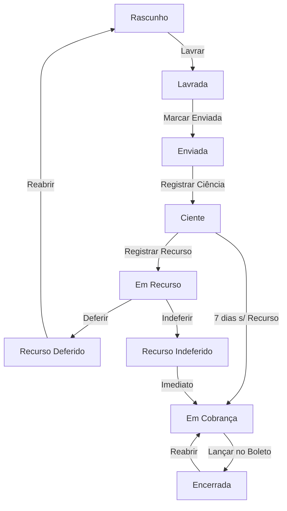

# Ciclo de Vida das Notificações - App Long Miami
*Atualizado em: 04/04/2026*

## Visão Geral

Uma **notificação** é um documento formal emitido pelo condomínio para comunicar um morador sobre uma irregularidade. É gerada a partir de ocorrências **homologadas** e segue um fluxo rigoroso de controle de fases, garantindo o direito ao contraditório e a correta aplicação de penalidades.

O sistema não utiliza mais papéis fixos (roles) para controle de acesso, mas sim um **Sistema de Permissões Granulares**.

---

## Estados (Status) e Fluxo

| Status | Slug | Descrição |
|--------|------|-----------|
| **Rascunho** | `rascunho` | Notificação em edição. Pode ser alterada livremente. |
| **Lavrada** | `lavrada` | Assinada digitalmente/oficialmente. Edição bloqueada. |
| **Enviada** | `enviada` | O documento saiu do condomínio rumo ao destinatário. |
| **Ciente** | `ciente` | Data em que o morador tomou conhecimento (inicia prazo de 7 dias). |
| **Em Recurso** | `em_recurso` | O morador contestou formalmente a notificação. |
| **Recurso Deferido** | `recurso_deferido` | A defesa foi aceita. A notificação pode ser anulada/reaberta. |
| **Recurso Indeferido** | `recurso_indeferido` | A defesa foi negada. Segue para cobrança. |
| **Em Cobrança** | `cobranca` | Fase onde o financeiro visualiza para lançar a multa. |
| **Encerrada** | `encerrada` | A multa já foi lançada no boleto. Ciclo concluído. |

---

## Fluxo de Cobrança e Prazos

A fase de **Cobrança** (`cobranca`) segue regras automáticas baseadas em datas e decisões:

1.  **Prazo de Carência**: Após a fase `ciente`, o sistema aguarda **7 dias corridos**. Se nenhum recurso for registrado nesse período, a notificação fica disponível para `cobranca`.
2.  **Pós-Recurso**: Se houver recurso e este for **indeferido**, a notificação salta imediatamente para a fase `cobranca`, independente do tempo decorrido desde a ciência.
3.  **Encampação em Recurso**: Não é possível mover para `cobranca` enquanto o status for `em_recurso`.
4.  **Encerramento**: O status `encerrada` é o marco final, indicando que o débito já consta no sistema financeiro/boleto do morador.

---

## Permissões e Ações

O acesso a cada transição é controlado pelas seguintes permissões:

| Ação | Permissão Necessária | Regra de Negócio |
|------|-----------------------|-------------------|
| **Lavrar** | `notificacao.lavrar` | Transforma Rascunho em Lavrada. Bloqueia edição do form. |
| **Marcar Enviada** | `notificacao.marcar_enviada`| Documento postado ou entregue ao mensageiro. |
| **Registrar Ciência** | `notificacao.registrar_ciencia`| Define a data base para contagem de prazo (7 dias). |
| **Registrar Recurso** | `notificacao.registrar_recurso`| Move para 'Em Recurso'. Bloqueia fluxo de cobrança. |
| **Julgar Recurso** | `notificacao.julgar_recurso` | Decide entre Deferido ou Indeferido. |
| **Lançar Cobrança** | `notificacao.marcar_cobranca` | Move para 'Em Cobrança'. Exige 7 dias de ciência ou recurso negado. |
| **Encerrar** | `notificacao.encerrar` | Finaliza o processo após confirmação de lançamento. |
| **Reabrir** | `notificacao.reabrir` | Reverte de 'Encerrada' para 'Cobrança' ou de 'Recurso' para 'Rascunho'. |

---

## Histórico e Auditoria (Timeline)

Toda mudança de estado é registrada na tabela `notificacao_fase_log`, contendo:
- **Fase Anterior e Nova**
- **Usuário responsável**
- **Data e Hora exata**
- **Observação/Justificativa** (Obrigatória em reaberturas e indeferimentos).

---

## Observações sobre Gestão de Acessos
> [!IMPORTANT]
> O sistema não utiliza mais grupos de usuários estáticos como 'Portaria' ou 'Sindico' no código. O administrador deve criar grupos livremente (ex: "Equipe Financeira") e atribuir as permissões acima (ex: `notificacao.encerrar`). 
